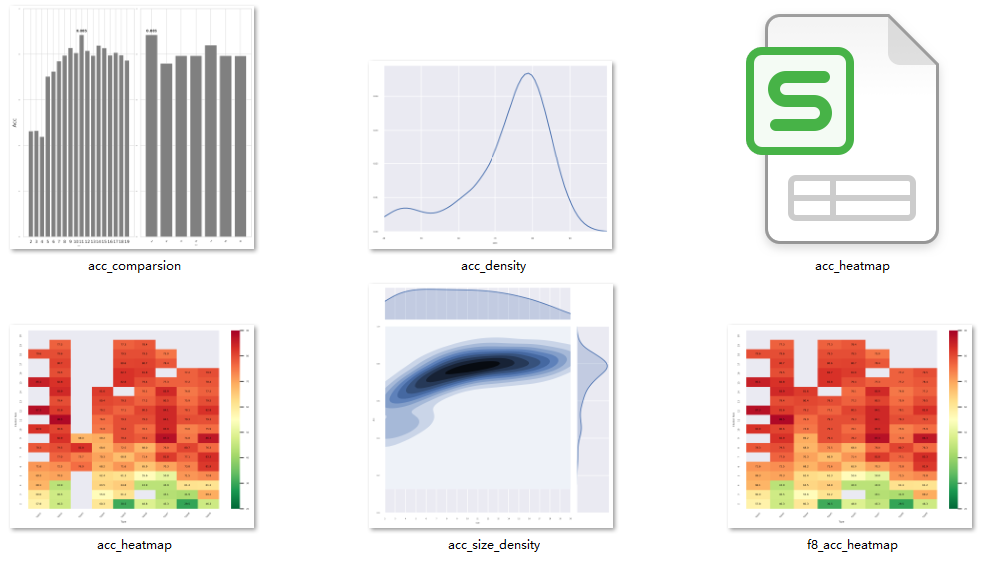
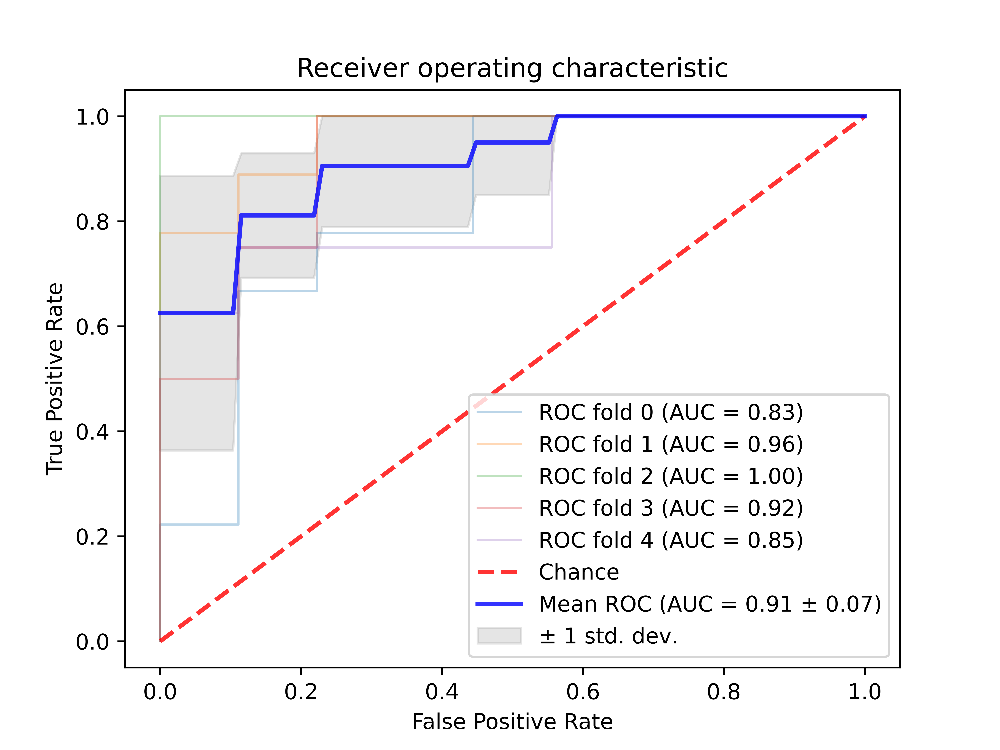
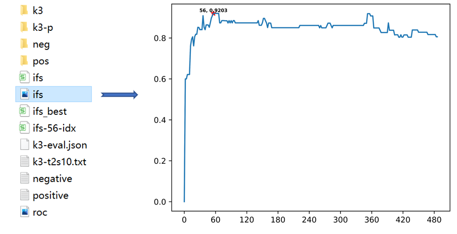

# RAATK

RAATK: A Python-based reduce amino acid toolkit of machine learning for protein sequence level inference.

- [User Manual](https://github.com/huang-sh/raatk/wiki/User-manual)
- [用户手册](https://github.com/huang-sh/raatk/wiki/%E7%94%A8%E6%88%B7%E6%89%8B%E5%86%8C)

Installation
------------
It is recommended to use pip for installation from github.
``` 
$ pip install git+https://github.com/huang-sh/raatk.git@master -U
```
or
```
$pip install raatk
```
All commands within paper can be tested by running demo.sh in demo directory after installing RAATK
```
$ ./demo.sh
```
------------
 Function
 ------------

- [view reduced amio acid alphabet](#sc-view)
- [reduce amino acid sequence](#sc-reduce)
- [extract sequence feature](#sc-extract)
- [evaluation](#sc-eval) 
- [result visualization](#sc-plot) 
- [ROC evaluation](#sc-roc)
- [feature selection](#sc-ifs) 
- [train model](#sc-train) 
- [prediction](#sc-predict) 
- [split data](#sc-split)
- [transfer format](#sc-transfer)

------------
Command
 ------------

### <a name="sc-view">view</a>
``` bash
$raatk view -t 9 -s 2 4 6 10 12 14 16 --visual
```
Output:
```
type9  2  IMVLFWY-GPCASTNHQEDRK                   BLOSUM50 matrix
type9  4  IMVLFWY-G-PCAST-NHQEDRK                 BLOSUM50 matrix
type9  6  IMVL-FWY-G-P-CAST-NHQEDRK               BLOSUM50 matrix
type9  10 IMV-L-FWY-G-P-C-A-STNH-QERK-D           BLOSUM50 matrix
type9  12 IMV-L-FWY-G-P-C-A-ST-N-HQRK-E-D         BLOSUM50 matrix
type9  14 IMV-L-F-WY-G-P-C-A-S-T-N-HQRK-E-D       BLOSUM50 matrix
type9  16 IMV-L-F-W-Y-G-P-C-A-S-T-N-H-QRK-E-D     BLOSUM50 matrix
```


### <a name="sc-reduce">reduce</a>

reduce sequence according to built-in reduction alphabets. And the output is stored in directories.

``` bash
$raatk reduce positive.txt negative.txt -t 1-8 -s 2-19 -o pos neg
```
reduce sequence according to specific amino acid cluster. The output result is in a single file.
``` bash
$raatk reduce positive.txt -c IMV-L-FWY-G-P-C-A-STNH-QERK-D -o reduce_positive.txt
```
### <a name="sc-extract">extract</a>
extract sequence features of directories, and the output is also stored in directories.
``` bash
$raatk extract pos neg -k 3 -d -o k3 -m
```
extract sequence features of files, and the output is also stored in files.
``` bash
$raatk extract pos/type9/4-IGPN.txt neg/type9/4-IGPN.txt -k 1 -o t9s4-k1.csv -m -raa IGPN
```

Output:

```
label,I,G,P,N
0.000000,0.125000,0.062500,0.562500,0.250000
0.000000,0.291667,0.166667,0.416667,0.125000
0.000000,0.277778,0.083333,0.416667,0.222222
                  ......
1.000000,0.177778,0.133333,0.377778,0.311111
1.000000,0.166667,0.000000,0.583333,0.250000
1.000000,0.387097,0.161290,0.322581,0.129032
```

And a feature file without label and the feature use 
``` bash
$raatk extract pos/type9/4-IGPN.txt -k 1 -o t9s4-k1p.csv -raa IGPN --count --label-f
```

Output:

```
I,G,P,N
2.000000,1.000000,9.000000,4.000000
7.000000,4.000000,10.000000,3.000000
10.000000,3.000000,15.000000,8.000000
                  ......
```
### <a name="sc-eval">eval</a>
evaluate the performance of different alphabet clusters based on machine learning. And the output is a json file.
``` bash
$raatk eval k3 -d -o k3-eval -clf svm -c 2 -g 0.5 -p 3
```
evaluate a single file.
``` bash
$raatk eval k3/type2/10-ARNCQHIFPW.csv -cv -1 -c 2 -g 0.5 -o k3-t2s10.txt
```
output:
```
                        0                         
0   38  7
1   7  36

      tp   fn   fp   tn   recall  precision  f1-score  
  0   38    7    7   36    0.84     0.84       0.84    
  1   36    7    7   38    0.84     0.84       0.84    
acc                                            0.84
mcc                                            0.68
-------------------------------------------------------
```
### <a name="sc-plot">plot</a>
result of json visualization
``` bash
$raatk plot k3-eval.json -o k3p
```
output:


### <a name="sc-roc">roc</a>
ROC evaluation
``` bash
$raatk roc k3/type2/10-ARNCQHIFPW.csv -clf svm -cv 5 -c 2 -g 0.5 -o roc
```
output:


### <a name="sc-ifs">ifs</a>
incremental feature selection 
``` bash
$raatk ifs k3/type2/10-ARNCQHIFPW.csv -s 2 -clf svm -cv 5 -c 2 -g 0.5 -o ifs
```
output:


### <a name="sc-train">train</a>

train a classifier for prediction
``` bash
$raatk train ifs_best.csv -clf svm -c 2 -g 0.5 -o svm.model -prob
```
### <a name="sc-predict">predict</a>
predict new data using trained model. The new data must be feature file without label and feature extract parameter must be same as training feature.
``` bash
$raatk predict new_data.csv -m svm.model -o 'test-result.csv'
```
### <a name="sc-split">split</a>
split feature data  into train and test subsets
``` bash
$raatk split ifs_best.csv -ts 0.3 -o test_split.csv
```
### <a name="sc-transfer">transfer</a>
transfer csv to arff for Weka.
``` bash
$raatk transfer ifs_best.csv -fmt arff
```
------------


Contact
------------
If you have any problem, contact me with hsh-me@outlook.com.
